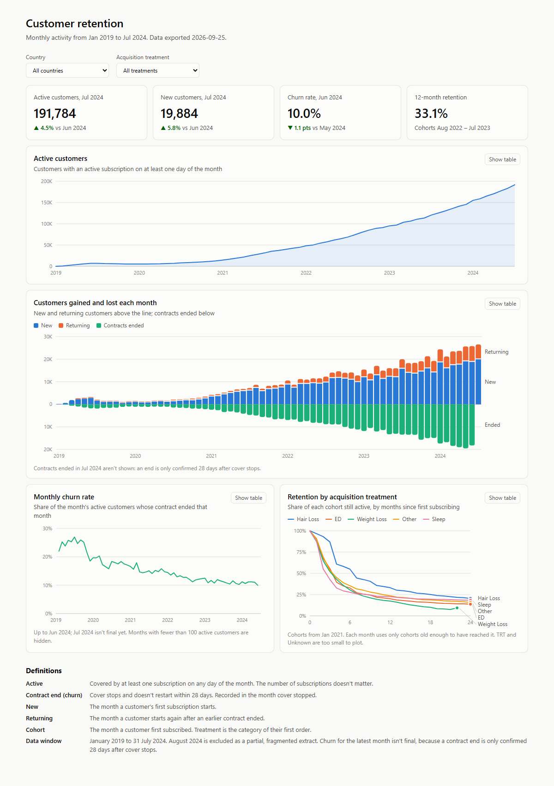
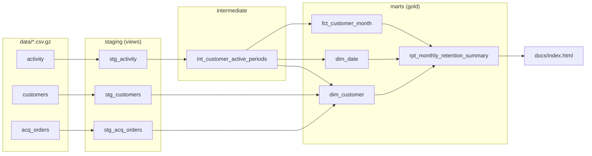

# Read me

The following describes my implementation of the AE assessment. The goal was to build a retention model that enables tracking using key metrics such as country and acquisition taxonomy.

**Contents:** [Tech stack justification](#tech-stack-justification) |
[Output discussion](#output-discussion) | [Limitations and issues](#limitations-and-issues) |
[The model](#the-model) | [Documentation](#documentation) | [Install](#install) |
[Tests](#tests) | [Repository layout](#repository-layout)

## Tech stack justification

The tech stack is:

- DuckDB - SQL engine
- dbt - transform logic
- HTML/Js - A static html dashboard

DuckDb was chosen as it allows reviewers to easily run this locally. Bigquery was considered as it is a part of the given tech stack, but without the ability to use LookML I deemed the difference from the perspective of a repo to be very small, contained mostly to SQL dialectical differences. DuckDb offers simplicity and ease of replication.

dbt was chosen as a part of the given tech stack, also providing a good opportunity for learning.

An html dashboard was chosen for the purposes of showing results in the absence of a dedicated dashboarding tool. Without the ability to use Looker, introducing a dedicated dashboarding tool would have added additional complexity and time to the project I did not feel was justified.



---

## Output discussion

Without a detailed set of requirements, I made some assumptions about the kind of output required for this assessment. Here are the principles I worked towards:

- Code maintainability and reusability - follow software engineering principles
- Enable extension - this may make the solution appear over-engineered for its size, but is optimised to be expanded on
- Simple, usable data models - overly complex layers generate maintenance burden, focus on facts and dimensions as core

### Schema

As requested in the brief, the retention model is built to enable analysis of retention from different angles.

A standard star schema (although with only one fact and two dims) was chosen as both a simple and efficient way to represent the data, optimised for reporting. To optimise the report's speed and make analysis easier, I included a reporting table on top, however this is not strictly necessary and only provides pre-summarised data.

### Churn definition

I noticed that your subscriptions frequently include short breaks. I wanted to model churn fairly, but the number of gaps would have made for an overwhelming picture, with customers jumping in and out. In the absence of stakeholder input, I decided that churn should be defined with a grace period. In a typical subscription model, churn counts when the date of subscription fails. In my model, I wait a pre-set (and modifiable) period of time before the customer is counted as churned. I decided for the purpose of analysis, 4 weeks would be sufficient; in the real world I would work this out with stakeholders.

My definition of churned introduces a small bit of complexity to the model. Periods smaller than a month mean a customer may churn in the same month they renew after a period of inactivity. I accepted this as a natural consequence of my definition. It means that 'churned' as a category can overlap with 'new'/'continuing'/'returning'. 

It is important for analysts and AI to understand the meaning of this definition, so it is included in the guidance.

### AI

AI would interact with the data using  modelled tables and their definitions, never the raw files. An LLM querying raw `activity.csv` would count subscriptions instead of customers, miss the 28-day grace rule and include the fragmented August extract. 

The models include important concepts pre-computed so they can't be done incorrectly or inconsistently.

I had AI make an [AI guide](docs/ai_guide.md) that has the rules and tested queries to give it. 

### Why report monthly

Supply periods are mostly 90 days, and normal reorders leave gaps of a few days between them. At daily grain customers would jump in and out; at quarterly grain real churn would be hidden. Monthly is the finest grain at which "active" is stable. I deliberately included a materialised int layer `int_customer_active_periods` for questions that aren't solved by the monthly grain. 

As with most of my decisions, I took this based on a best guess. In the real world I would work with stakeholders to understand what they are reporting on and how the information here creates value for them.

This is partially why I chose to use a grace period variable rather than a simple definition such as churn meaning one month of no active subscription. This can work for months at a fixed grain, but doesn't let users use a different grace period or developers easily implement a different grain. My model lets you change these parameters quite easily without breaking other parts.

With more data and time spent on this assessment, there is plenty of opportunity for tracking metrics on a daily or weekly grain.

### Submission criteria

Below is how I aimed to meet the submission criteria:

**Ease of use** - this phrase has multiple interpretations; I understood it to mean if the data model enables analysts to easily learn about the key metrics discussed in the brief, proven with the example queries.

**Modelling concepts** - Following my usage of a star schema and layers in dbt, based of my understanding of how it will be used.

**Correctness** - I included tests, conducted preliminary investigation (spotting the August 2024 data issue) and made best efforts to ensure I had correctly interpreted and transformed the data.

---

## Limitations and issues

The main issue I noticed was problematic data in August 2024, where subscription durations do not appear to be bucketed correctly. Although it might be possible to remedy, out of caution I decided to treat the data as suspect and exclude it from usage downstream, though I did not remove it from the staging layer.

I did not include any usage of snapshots or SCD logic as this is static data. In a real scenario, this data would be updated frequently; that would require an enhanced approach.

I folded Mental Health Group folded into Other Group - too small to report as a segment.

24,154 customers had no acquisition record. Most never ordered. I recorded them as `Unknown`.


### Additional data for future analysis

You can only see customer by acquisition orders, not the actual subscription they are using. If someone changes product subscription or uses more than one, this is not a drillable component.

No cancellation or payment data. Churn is inferred from gaps in cover. You could split into subscription-status events with voluntary and involuntary (failed payment) info.

No revenue. Revenue churn and lifetime value aren't there.

65% of customers have subscriptions running at the same time - this loses some data information. Other analysis could look at subscription overlap.

---

## The model



| Layer | Model | Grain | Rows | Use it for |
|---|---|---|---|---|
| Staging | `stg_activity`, `stg_customers`, `stg_acq_orders` | as source | | Renamed and typed source data. Nothing removed. |
| Intermediate | `int_customer_active_periods` | customer × continuous active period | 649,146 | Day-level questions: activity between any two dates, contract lengths, time away |
| Mart | `dim_customer` | customer | 532,848 | Customer attributes and segments: country, treatment, cohort |
| Mart | `dim_date` | day | 2,039 | Calendar; the churn-completeness flag |
| Mart | `fct_customer_month` | customer × month | 3,962,648 | **The main analysis table.** Active customers, movements, churn, cohorts |
| Mart | `rpt_monthly_retention_summary` | cohort × month × country × treatment | 10,025 | Dashboard input. Pre-aggregated counts |

---

## Documentation

| Guide | What's in it |
|---|---|
| [User guide](docs/user_guide.md) | Which table to use, definitions of every metric, full column reference, how to query, common pitfalls |
| [AI guide](docs/ai_guide.md) | Rules for AI assistants querying the data, and tested example queries for the key business questions |

---

## Install

Needs [uv](https://docs.astral.sh/uv/). It installs the right Python and every dependency.

```bash
uv sync                                  # Python 3.12, dbt-core, dbt-duckdb, duckdb
uv run dbt deps                          # dbt packages (dbt_utils)
uv run dbt build                         # build all models and run all 63 tests (~30s)
uv run python scripts/export.py          # write the dashboard's data to docs/data.js
```

Open `docs/index.html` in a browser.

Query the tables:

```bash
uv run python scripts/explore.py         # DuckDB's SQL editor at http://localhost:4213
```

Stop it (press Enter) before running `dbt build` again: an open connection locks `warehouse.duckdb`.

For the documentation site with the lineage graph and every column description:

`uv run dbt docs generate`

`uv run dbt docs serve`

---

## Repository layout

```
data/            raw extracts, gzipped
models/
  staging/       stg_* views, 1:1 with sources
  intermediate/  int_customer_active_periods (the merge)
  marts/         dim_customer, dim_date, fct_customer_month, rpt_monthly_retention_summary
tests/           custom SQL tests
scripts/         export.py (dashboard data), explore.py (DuckDB UI)
docs/            the dashboard (index.html, data.js) and screenshot
dbt_project.yml  project config and the two analysis parameters
profiles.yml     DuckDB connection (committed; no credentials)
```
